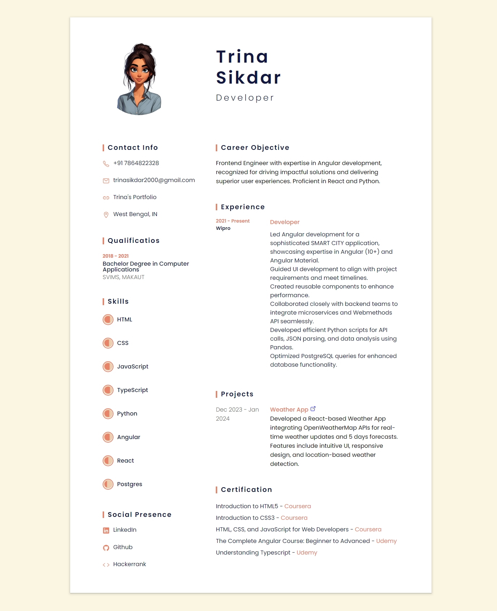

# Trina's CV

Welcome to my CV! This repository hosts my CV designed for assignment purposes, deployed using GitHub Pages. It highlights my journey as a frontend engineer specializing in Angular development, with additional skills in React and Python.

Currently, I am leveraging my expertise at Wipro, where I lead Angular development for SMART CITY applications. Feel free to explore my projects, certifications, and more about my professional background. Connect with me on [LinkedIn](https://www.linkedin.com/in/trina-sikdar/) and [GitHub](https://github.com/itsmetrina/) for further insights into my work.

## Screenshots

